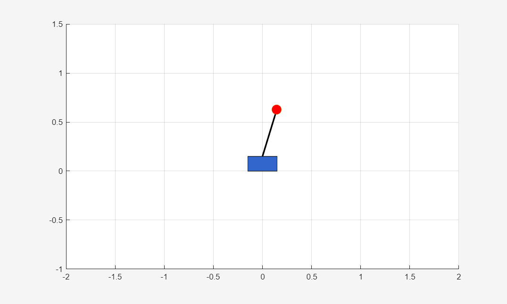
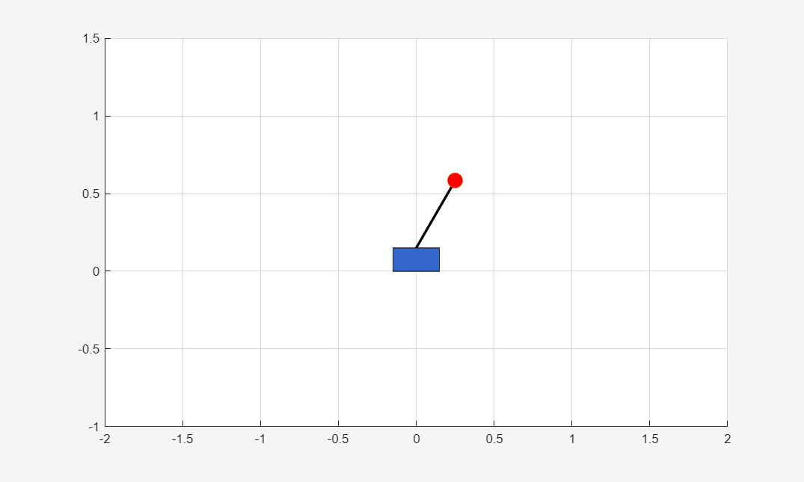
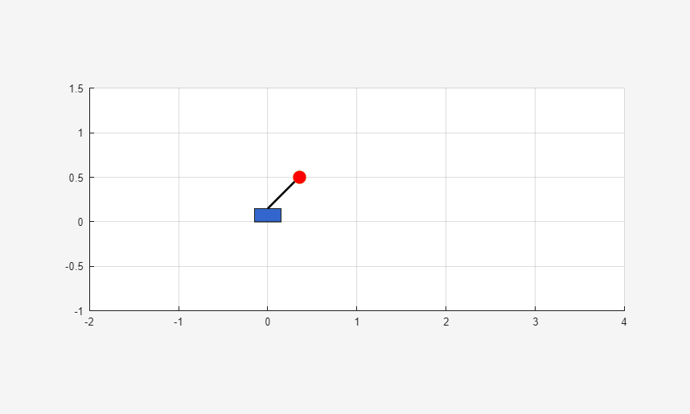
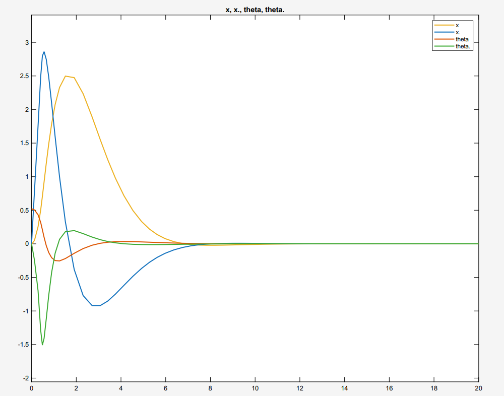

# MATLAB Inverted Pendulum LQR Controller
A cart-pole inverted pendulum stabilized using an LQR controller, derived from first Lagrangian mechanics through to a working state-space controller in MATLAB and Simulink.






## Overview

This project models a classic controls problem: a pendulum mounted on a cart that can slide horizontally, with the goal of keeping the pendulum balanced upright with the only input being a horizontal force on the cart. After introducing myself to Lagrangian mechanics, I derived the full nonlinear equations of motion, linearized them around the upright position (θ = 0), converted the system to state-space form, and designed an LQR (Linear-Quadratic Regulator) controller to stabilize it. I then tested the controller's real-world limits by simulating actuator saturation - capping how much force the "motor" can actually deliver - to find the point where the controller stops being able to recover, given the motors input constraints.

I did this as a self-directed project to build controls/simulation skills relevant to drone, robotics, and aerospace. The goal wasn't just a working demo, but actually learning and understanding every step well enough to explain and extend it.

## Methodology

### Deriving the equations of motion

Using the Lagrangian method (L = T − V), I defined the system with two generalized coordinates: cart position x and pendulum angle θ (measured from vertical, upright = 0). Working through kinetic and potential energy for both the cart and pendulum, then applying the Euler-Lagrange equation to each coordinate, gives the nonlinear coupled equations of motion:

(M+m)ẍ + mL(cosθ·θ̈ − sinθ·θ̇²) = F
ẍcosθ + Lθ̈ − gsinθ = 0

I cross-checked this derivation against an independent source (a University of Queensland METR4202 tutorial on the same system) and allthough slightly different method, got an exact match - a good confirmation the derivation was correct before building anything further on top of it.

### Linearization and state-space form

Linearizing around upright (sinθ≈θ, cosθ≈1, dropping the θ̇² term) and solving for ẍ and θ̈  gives a linear system in state-space form, ż = Az + Bu, with state vector z = [x, ẋ, θ, θ̇]ᵀ and input u = F:

```
A = [0   1   0        0
     0   0  −mg/M      0
     0   0   0        1
     0   0  (M+m)g/(LM) 0]

B = [0; 1/M; 0; −1/(LM)]
```

Checking eig(A) confirms what's physically obvious — upright is an unstable equilibrium, with one positive eigenvalue. rank(ctrb(A,B)) = 4 confirms the system is fully controllable from the single force input despite being underactuated (1 input, 4 states).

### Controller design (LQR)

Rather than hand-tuning gains (which doesn't scale well to a coupled, multi-state system like this), I used LQR to compute the optimal state-feedback gain K for u = -Kz , given a cost function that weights state error (Q) against control effort (R):

```matlab
Q = diag([1, 1, 10, 10]);   % prioritize pendulum angle over cart position
R = 1;
K = lqr(A, B, Q, R);
```

I weighted θ` and θ̇` more heavily than x and ẋ, since keeping the pendulum upright matters more than exactly where the cart ends up. The resulting closed-loop eigenvalues (eig(A-B*K)) all have negative real parts, confirming the controller stabilizes the system — verified three separate ways: analytically (eigenvalues), in MATLAB (initial() simulation), and in Simulink (block-diagram model), with all three agreeing.

## Results

### Stable response

With a 30° initial offset, the controller brings the pendulum back to upright smoothly, with the cart settling more slowly than the pendulum angle - a direct consequence of the Q-weighting prioritizing θ over x.



### Actuator saturation — finding the real-world limit

An ideal LQR controller assumes it can apply any force instantly, which no real motor can do. To test this, I added a Saturation block in Simulink limiting the force output, then found the minimum force capability needed to still stabilize the system at a few different initial angles:

| Initial angle | Force threshold |
| 17° (0.30 rad) | 4 N |
| 30° (0.52 rad) | 7 N |
| 45° (0.79 rad) | 10 N |

The threshold scales almost linearly with initial angle - roughly **13 N/rad** across all three points - which lines up with the linearized model, since the restoring term is proportional to θ. Below the threshold for a given angle, the system doesn't just respond more slowly - it goes unstable, with x and θ diverging rather than settling.


### Animation

I built a simple MATLAB animation (rectangle for the cart, line + marker for the pendulum) driven directly off the simulation output, to make the stabilization - and the failure case - easier to actually see rather than just read off a plot.


## Limitations & future work

- The linear model breaks down at large angles (sinθ≈θ stops holding well past ~20-30°), so the controller's performance at extreme initial angles isn't reliably predicted by this model - a nonlinear plant model would be needed to test that honestly.
- No sensor noise or actuator delay is modeled yet - a real system would have both, and I'd expect them to erode the margin found in the saturation testing further.
- A natural next step would be swing-up control (getting the pendulum from hanging down to upright, rather than just balancing near upright) - a genuinely different, harder nonlinear control problem I'd want to tackle as a follow-up project.

## Tools

MATLAB, Simulink, Control System Toolbox (lqr, ctrb, eig, initial)
